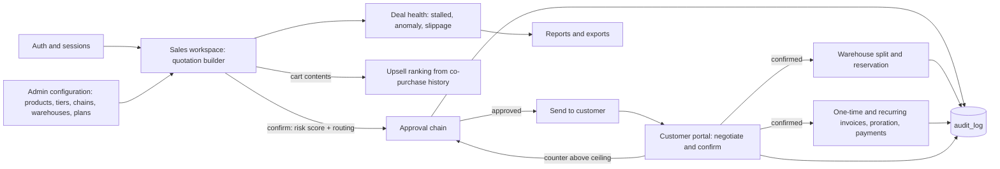

# DealFlow360 architecture

Generated by `pnpm erd` from `prisma/schema.prisma` (36 tables). Do not edit the diagram by hand.

## How the modules connect

## Table groups

- **Identity**: app_user, session, customer_tier, customer, customer_contact, portal_session, portal_login_token
- **Catalogue**: product_category, product, pricelist_rule, product_pairing
- **Governance**: approval_rule, risk_config, counter
- **Quotation**: quotation, quotation_line, approval_request, approval_step, audit_log
- **Fulfillment**: warehouse, stock_level, stock_move, fulfillment_plan, shipment, fulfillment_line, fulfillment_prompt
- **Billing**: recurring_plan, subscription, billing_schedule, subscription_change, invoice, invoice_line, credit_note, payment
- **Portal and health**: portal_request, deal_alert

## Three design decisions

1. **Integer primary keys plus a random public id.** Joins stay small and fast; anything in a URL (quotation, customer, invoice, subscription) uses a 12 character random `public_id`, and the portal additionally scopes every query by the customer on the session.
2. **Per-line ceiling = min(tier ceiling, category ceiling).** The risk score checks every line against its own limit (PDF section 10), then blends the worst overage, the value-weighted overage and a margin-floor penalty with weights from `risk_config`. Routing picks the longest chain among the `approval_rule` rows that fire.
3. **Day-based proration from the real period.** Subscriptions store their actual period dates; a mid-cycle change credits the old quantity and charges the new one for the remaining calendar days, rounded half-up once per component. Money is integer paise everywhere, percentages are integer basis points.

## Entity relationship diagram

```mermaid
erDiagram
  app_user {
    int id PK
    string email UK
    string name
    string passwordHash
    enum role
    int managerId FK
    boolean isActive
    datetime createdAt
  }
  session {
    int id PK
    string token UK
    int userId FK
    datetime expiresAt
    datetime createdAt
  }
  customer_tier {
    int id PK
    string name UK
    int discountCeilingBp
    int sortOrder
    datetime createdAt
  }
  customer {
    int id PK
    string publicId UK
    string name
    string email
    string city
    int tierId FK
    datetime archivedAt
    datetime createdAt
  }
  customer_contact {
    int id PK
    int customerId FK
    string email UK
    string name
    string passwordHash
    boolean isPrimary
    datetime createdAt
  }
  portal_session {
    int id PK
    string token UK
    int contactId FK
    datetime expiresAt
    datetime createdAt
  }
  portal_login_token {
    int id PK
    string tokenHash UK
    int contactId FK
    int quotationId
    datetime expiresAt
    datetime usedAt
    datetime createdAt
  }
  product_category {
    int id PK
    string name UK
    int discountCeilingBp
    int minMarginBp
    int sortOrder
    datetime createdAt
  }
  product {
    int id PK
    string sku UK
    string name
    string description
    enum kind
    boolean isSubscription
    enum recurringInterval
    int categoryId FK
    string unit
    int listPrice
    int cost
    int taxBp
    boolean isPromoted
    int parentId FK
    string variantLabel
    int extraPrice
    datetime archivedAt
    datetime createdAt
    datetime updatedAt
  }
  pricelist_rule {
    int id PK
    int tierId FK
    int categoryId FK
    int productId FK
    int discountBp
    string currency
    string note
    datetime createdAt
  }
  product_pairing {
    int id PK
    int productId FK
    int pairedProductId FK
    int coCount
  }
  approval_rule {
    int id PK
    int sequence UK
    string name
    int minScore
    int maxWorstOverageBp
    int maxOrderTotal
    json chain
    boolean isActive
    datetime updatedAt
  }
  risk_config {
    int id PK
    int wWorst
    int wBlended
    int wMargin
    int normWorstBp
    int normBlendedBp
    int normMarginBp
    int floorMarginBp
    int stalledDays
    float anomalyZ
    int anomalyAbsBp
    int minHistory
    datetime updatedAt
    int updatedById
  }
  counter {
    string key PK
    int value
  }
  quotation {
    int id PK
    string publicId UK
    string number UK
    int customerId FK
    int repUserId FK
    enum status
    string currency
    int orderDiscountBp
    int grossTotal
    int discountTotal
    int netTotal
    int taxTotal
    int total
    int costTotal
    int marginBp
    int riskScore
    json riskBreakdown
    int approvalVersion
    int version
    boolean negotiationPending
    datetime promisedDate
    string notes
    datetime sentAt
    datetime confirmedAt
    int confirmedByContactId
    string confirmedName
    datetime lastActivityAt
    datetime createdAt
    datetime updatedAt
  }
  quotation_line {
    int id PK
    int quotationId FK
    int productId FK
    int planId FK
    enum lineType
    enum source
    string description
    int qty
    int unitPrice
    int unitCost
    int taxBp
    int discountBp
    int effectiveDiscountBp
    int ceilingBp
    int pricelistRuleId
    int gross
    int discountAmount
    int net
    int tax
    int total
    int sortOrder
    datetime createdAt
    datetime updatedAt
  }
  approval_request {
    int id PK
    int quotationId FK
    int version
    enum status
    int riskScore
    json riskBreakdown
    json chain
    string reason
    datetime createdAt
    datetime resolvedAt
  }
  approval_step {
    int id PK
    int requestId FK
    int stepNo
    enum requiredRole
    enum status
    int actedById FK
    datetime actedAt
    string note
  }
  audit_log {
    int id PK
    string entityType
    int entityId
    int quotationId FK
    string action
    enum actorType
    int actorId
    string actorName
    string actorRole
    string reason
    json beforeJson
    json afterJson
    datetime at
  }
  warehouse {
    int id PK
    string name UK
    string city
    int shipCostWeight
    int priority
    datetime archivedAt
    datetime createdAt
  }
  stock_level {
    int id PK
    int warehouseId FK
    int productId FK
    int onHand
    int reserved
    int reorderPoint
    int leadDays
    datetime updatedAt
  }
  stock_move {
    int id PK
    int stockLevelId FK
    enum type
    int qty
    int quotationId
    int shipmentId
    string note
    int createdById
    datetime createdAt
  }
  fulfillment_plan {
    int id PK
    int quotationId FK
    enum status
    boolean isManual
    int shipmentCount
    int estCost
    string reason
    int createdById
    int acceptedById
    datetime acceptedAt
    datetime createdAt
  }
  shipment {
    int id PK
    int planId FK
    int warehouseId FK
    enum status
    int shipCost
    datetime shippedAt
    datetime createdAt
  }
  fulfillment_line {
    int id PK
    int planId FK
    int quotationLineId FK
    int warehouseId FK
    int shipmentId FK
    int qty
    boolean isBackorder
    datetime expectedDate
  }
  fulfillment_prompt {
    int id PK
    int planId FK
    string type
    string message
    json payload
    enum status
    datetime createdAt
    datetime resolvedAt
  }
  recurring_plan {
    int id PK
    string name UK
    enum interval
    int periods
    enum prorationMode
    boolean billChangeDay
    enum cancelPolicy
    enum refundMethod
    int productId FK
    datetime archivedAt
    datetime createdAt
  }
  subscription {
    int id PK
    string publicId UK
    int customerId FK
    int quotationId FK
    int quotationLineId UK
    int productId FK
    int planId FK
    int qty
    int unitPrice
    int discountBp
    int taxBp
    enum status
    datetime anchorDate
    datetime currentPeriodStart
    datetime currentPeriodEnd
    datetime cancelledAt
    datetime cancelEffective
    datetime createdAt
    datetime updatedAt
  }
  billing_schedule {
    int id PK
    int subscriptionId FK
    datetime periodStart
    datetime periodEnd
    datetime billDate
    int net
    int tax
    int total
    enum status
    int invoiceId FK
  }
  subscription_change {
    int id PK
    int subscriptionId FK
    enum type
    datetime effectiveDate
    int oldQty
    int newQty
    int daysInPeriod
    int remainingDays
    int credit
    int charge
    int net
    int invoiceId
    int creditNoteId
    string note
    int createdById
    datetime createdAt
  }
  invoice {
    int id PK
    string publicId UK
    string number UK
    enum kind
    int customerId FK
    int quotationId FK
    int subscriptionId FK
    enum status
    int subtotal
    int taxTotal
    int total
    int paidAmount
    datetime issueDate
    datetime dueDate
    datetime periodStart
    datetime periodEnd
    datetime paidAt
    datetime createdAt
    datetime updatedAt
  }
  invoice_line {
    int id PK
    int invoiceId FK
    int quotationLineId FK
    string description
    int qty
    int unitPrice
    int discountBp
    int net
    int taxBp
    int tax
    int total
    int sortOrder
  }
  credit_note {
    int id PK
    string number UK
    int customerId FK
    int invoiceId FK
    int subscriptionId FK
    int amount
    string reason
    enum status
    int appliedToInvoiceId FK
    datetime createdAt
  }
  payment {
    int id PK
    int invoiceId FK
    enum kind
    int amount
    string method
    string clientRef UK
    string reference
    string note
    datetime receivedAt
    int createdById
  }
  portal_request {
    int id PK
    int quotationId FK
    int lineId FK
    int contactId FK
    enum type
    string message
    int proposedDiscountBp
    datetime requestedDeliveryDate
    enum status
    string responseNote
    int respondedById
    datetime respondedAt
    datetime createdAt
  }
  deal_alert {
    int id PK
    int quotationId FK
    enum type
    int severity
    string message
    json payload
    datetime firstSeenAt
    datetime lastSeenAt
    datetime resolvedAt
    datetime lastNudgedAt
    datetime escalatedAt
  }
  app_user o|--o{ app_user : "managerId"
  app_user ||--o{ session : "userId"
  customer_tier ||--o{ customer : "tierId"
  customer ||--o{ customer_contact : "customerId"
  customer_contact ||--o{ portal_session : "contactId"
  customer_contact ||--o{ portal_login_token : "contactId"
  product_category ||--o{ product : "categoryId"
  product o|--o{ product : "parentId"
  customer_tier ||--o{ pricelist_rule : "tierId"
  product_category o|--o{ pricelist_rule : "categoryId"
  product o|--o{ pricelist_rule : "productId"
  product ||--o{ product_pairing : "productId"
  product ||--o{ product_pairing : "pairedProductId"
  customer o|--o{ quotation : "customerId"
  app_user ||--o{ quotation : "repUserId"
  quotation ||--o{ quotation_line : "quotationId"
  product ||--o{ quotation_line : "productId"
  recurring_plan o|--o{ quotation_line : "planId"
  quotation ||--o{ approval_request : "quotationId"
  approval_request ||--o{ approval_step : "requestId"
  app_user o|--o{ approval_step : "actedById"
  quotation o|--o{ audit_log : "quotationId"
  warehouse ||--o{ stock_level : "warehouseId"
  product ||--o{ stock_level : "productId"
  stock_level ||--o{ stock_move : "stockLevelId"
  quotation ||--o{ fulfillment_plan : "quotationId"
  fulfillment_plan ||--o{ shipment : "planId"
  warehouse ||--o{ shipment : "warehouseId"
  fulfillment_plan ||--o{ fulfillment_line : "planId"
  quotation_line ||--o{ fulfillment_line : "quotationLineId"
  warehouse o|--o{ fulfillment_line : "warehouseId"
  shipment o|--o{ fulfillment_line : "shipmentId"
  fulfillment_plan ||--o{ fulfillment_prompt : "planId"
  product o|--o{ recurring_plan : "productId"
  customer ||--o{ subscription : "customerId"
  quotation o|--o{ subscription : "quotationId"
  quotation_line o|--o{ subscription : "quotationLineId"
  product ||--o{ subscription : "productId"
  recurring_plan ||--o{ subscription : "planId"
  subscription ||--o{ billing_schedule : "subscriptionId"
  invoice o|--o{ billing_schedule : "invoiceId"
  subscription ||--o{ subscription_change : "subscriptionId"
  customer ||--o{ invoice : "customerId"
  quotation o|--o{ invoice : "quotationId"
  subscription o|--o{ invoice : "subscriptionId"
  invoice ||--o{ invoice_line : "invoiceId"
  quotation_line o|--o{ invoice_line : "quotationLineId"
  customer ||--o{ credit_note : "customerId"
  invoice o|--o{ credit_note : "invoiceId"
  invoice o|--o{ credit_note : "appliedToInvoiceId"
  subscription o|--o{ credit_note : "subscriptionId"
  invoice ||--o{ payment : "invoiceId"
  quotation ||--o{ portal_request : "quotationId"
  quotation_line o|--o{ portal_request : "lineId"
  customer_contact ||--o{ portal_request : "contactId"
  quotation ||--o{ deal_alert : "quotationId"
```

